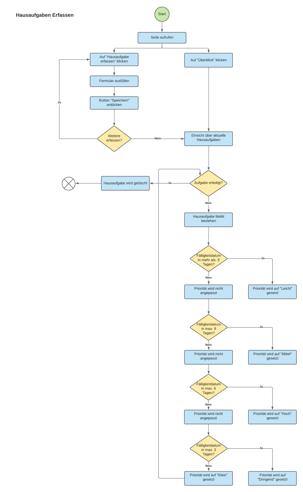

# Hausaufgabenerfasser

## 1. Ausgangslage
Aktuell habe ich keinen Überblick über meine Hausaufgaben und kann nicht abschätzen, welche Aufgabe welche Priorität hat. 

## 2. Projektidee
Die Webapplikation soll mir bei der Hausaufgabenplanung helfen, in dem mir anhand der Fälligkeit die Hausaufgaben priorisiert werden. Die Applikation frägt das aktuelle Datum ab und vergleicht diese mit der Fälligkeit der Aufgabe. Damit wird die Priorität berechnet. 

## 3. Flowmap

## 4. Anleitung
Damit die Applikation korrekt funktioniert, müssen folgende Module importiert werden:
<ul>
    <li>Flask (Flask, render_template, request, url_for)</li>
    <li>Datetime</li>
</ul>

### Home
Durch das Anwählen der jeweiligen Buttons gelangt der User auf die Seiten "Überblick" und "Erfassen" 
Zudem werden auf der Startseite die drei neusten Einträge angezeigt.

### Erfassen
Auf der Seite werden die Hausaufgaben erfasst. Die Module sind vorgegeben und können durch ein Drop-Down-Element ausgewählt werden.  
Der Titel, sowie die Notizen können manuell eingegeben werden.  
Das Fälligkeitsdatum wird mit dem input type "date" angezeigt und das Datum kann durch den "Assistenten" ausgewählt werden.   
Durch Klick auf "Speichern" werden die Daten im Hintergrund in eine Liste als Dictionary ins JSON-File "datenspeicher.json" gespeichert. Für den User erscheint die Meldung, dass die Hausaufgabe erfasst wurde.

### Überblick
Auf der Überblick-Seite werden alle Hausaufgaben nach Modul in einem Akkordeon aufgelistet, welche noch nicht erledigt wurden. Zudem werden auf der Übersicht-Seite die Anzahl Einträge in diesem spezifischen Moudl und die %-Anzahl von den Gesamthausaufgaben angezeigt. Durch Klick auf den Modul-Titel, werden die Hausaufgaben von diesem Modul in einer Tabelle aufgelistet.  
#### Priorität
Ist die Aufgabe in max. 3 Tagen fällig, wird die Priorität "Dringend" vergeben.  Wenn sie in max. 6 Tagen fällig ist, wird die Priorität "Hoch" vergeben.  Bei max. 9 Tage die Priorität "Mittel".  Alle anderen haben die Priorität "Klein".

#### Hausaufgabe abgeschlossen
Sobald eine Hausaufgabe erledigt wurde, kann sie in der Übersichtsliste entfernt werden. 
Dies kann erledigt werden, indem der User in der Spalte "Erledigt?" in der Tabelle den Radio-Button auf "Ja" setzt und den Eintrag speichert. 
Danach wird der ganze Datensatz im JSON und somit auch von der Liste entfernt.

## 5. Funktionen
<ul>
    <li>Dateineingabe: Neue Hausaugaben erfassen</li>
    <li>Datenspeicherung: Hauaufgaben werden in JSON-Datei gespeichert</li>
    <li>Datenverarbeitung: Hausaufgaben werden nach Modulen in Listen aufgeteilt und deren Anzahl und %-Anteil der Gesamtaufgaben angezeigt, Priorität wird anhand Fälligkeitsdatum berechnet, Auf Home werden die drei neusten Aufgaben angezeigt, Mittels Erledigt-Status "Ja" wird die Hausaufgabe aus JSON-Datei gelöscht</li>
    <li>Datenausgabe: Ausgabe der Hausaufgaben nach Modulen, Priorität, Anzahl Aufgaben in Modulenn, %-Anteil Modul von Gesamtaufgaben</li>
</ul>